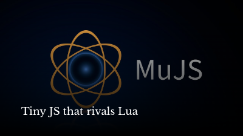

# Lust2D

## Quick Start

```console
$ cc -o nob nob.c
$ ./nob
$ ./build/lust2d ./game.js
```

## Screencast

This project was originally started on a livestream:

[](https://www.youtube.com/watch?v=4kuxeEnFVYw)
